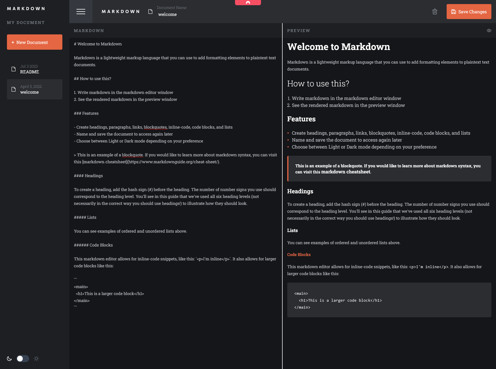

# Frontend Mentor - In-browser markdown editor

This is a solution to the [In-browser markdown editor](https://www.frontendmentor.io/challenges/inbrowser-markdown-editor-r16TrrQX9).

## Table of contents

- [Frontend Mentor - In-browser markdown editor](#frontend-mentor---in-browser-markdown-editor)
  - [Table of contents](#table-of-contents)
  - [Overview](#overview)
    - [The challenge](#the-challenge)
    - [Screenshot](#screenshot)
    - [Links](#links)
  - [My process](#my-process)
    - [Built with](#built-with)
    - [Continued development](#continued-development)
  - [Author](#author)

## Overview

### The challenge

Users should be able to:

Create, Read, Update, and Delete markdown documents
- Name and save documents to be accessed as needed
- Edit the markdown of a document and see the formatted preview of the content
- View a full-page preview of the formatted content
- View the optimal layout for the app depending on their device's screen size
- See hover states for all interactive elements on the page
- Use localStorage to save the current state in the browser that persists when the browser is refreshed
- **Bonus**: Build this project as a full-stack application (Need to Add)

### Screenshot

### Links

- Solution URL: [Solution](https://www.frontendmentor.io/solutions/in-browser-markdown-editor-5IJEhwVeEG)
- Live Site URL: [Live Site](https://markdown-editor-mt.netlify.app/)

## My process

### Built with

- Semantic HTML5 markup
- CSS custom properties
- Flexbox
- CSS Grid
- [React](https://reactjs.org/) - JS library
- [Tailwind CSS](https://tailwindcss.com/) - Tailwind CSS

### Continued development

Will add features such as:
 - Uploading and Download Markdown Files
 - Full Stack Application (Database and Login/Accounts)

## Author

- Website - [Mondara](https://mondarathotage.com/)
- Linkedin - [@Mondara](https://www.linkedin.com/in/mondara-thotage/)
- Github - [@Mondara](https://github.com/Mondara)

